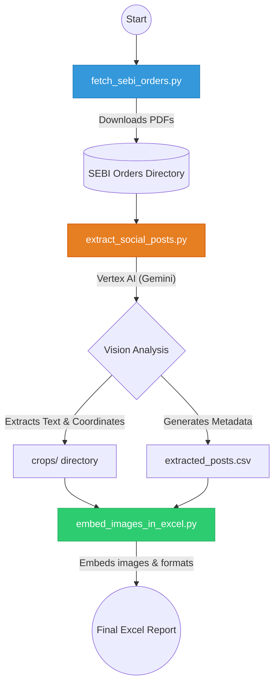

# SEBI Orders Social Media Extractor

A robust, end-to-end automated pipeline to download Securities and Exchange Board of India (SEBI) enforcement and exemption orders, parse the PDF documents, and intelligently extract screenshots and text of social media manipulations (Telegram, WhatsApp, Twitter, etc.) using Google Vertex AI (Gemini Vision).

## Key Features

- **Automated Web Scraping:** Headless downloading of SEBI orders by specific years or recent counts.
- **Intelligent Vision Extraction:** Uses Vertex AI's multimodal capabilities to scan hundreds of PDF pages, identifying screenshots of social media posts, chats, and internal communications.
- **Auto-Cropping:** Calculates bounding boxes and automatically crops the identified screenshots from the PDF pages.
- **Rich Reporting:** Generates a structured CSV, an HTML preview, and a beautifully formatted Excel report with the actual screenshot images embedded directly into the spreadsheet alongside the extracted text and metadata.

---

## Architecture & Workflow

The pipeline consists of three main stages: **Acquisition**, **Extraction**, and **Reporting**.



### 1. Acquisition (`fetch_sebi_orders.py`)
Scrapes the SEBI website using Playwright to handle Javascript pagination and iframe PDF embeddings.
- Capable of downloading by year (e.g., all of 2026).
- Capable of downloading a specific count of the most recent orders.

### 2. Extraction (`extract_social_posts.py`)
The core engine. It converts PDF pages to images in-memory and sends them to Vertex AI to detect social media posts.
- **Input:** Directory of PDFs.
- **Output:** `extracted_posts.csv` and individual image crops saved in the `crops/` folder.

### 3. Reporting (`embed_images_in_excel.py` / `csv_to_excel.py`)
Takes the raw CSV data and the physical image crops and stitches them together into a final, shareable Excel document where the images are embedded natively in the cells.

---

## Setup & Installation

### Prerequisites
1. **Python 3.9+**
2. **Google Cloud Vertex AI** (You must have a Google Cloud Project with the Vertex AI API enabled).
3. **Playwright** (for headless browser scraping).

### 1. Install Dependencies
```bash
pip install -r requirements.txt
# Install Playwright browser binaries
playwright install chromium
```
*(Dependencies include: `google-genai`, `PyMuPDF`, `Pillow`, `pandas`, `openpyxl`, `playwright`, `python-dotenv`)*

### 2. Configure Environment Variables
Create a `.env` file in the root of the project to store your Vertex AI Project ID securely.
```env
VERTEX_PROJECT_ID=your-google-cloud-project-id
```

---

## Usage Guide

### Step 1: Download SEBI Orders
Run the fetch script to populate a local directory with PDFs.

**Download specific year:**
```bash
python3 fetch_sebi_orders.py --year 2025
```

**Download recent N orders:**
```bash
python3 fetch_sebi_orders.py --recent 50
```

### Step 2: Extract Social Media Data
Ensure `PDF_DIR` in `extract_social_posts.py` points to the folder you just downloaded (e.g., `sebi order 2025`). Run the extraction:

```bash
python3 extract_social_posts.py
```
*Note: Depending on the number of PDFs and pages, this may take some time. The script automatically handles Vertex AI rate limits and fallbacks.*

### Step 3: Generate Final Excel Report
Once extraction is complete, compile everything into an Excel file:

```bash
python3 embed_images_in_excel.py
```
This will output `final_extracted_posts_with_images.xlsx` containing the structured data and embedded screenshots!

---

## Security Note
The `.gitignore` is configured to prevent accidental uploads of your `.env` file, as well as any downloaded PDFs, temporary logs, or output CSV/Excel files. Only the source code is tracked by version control.
