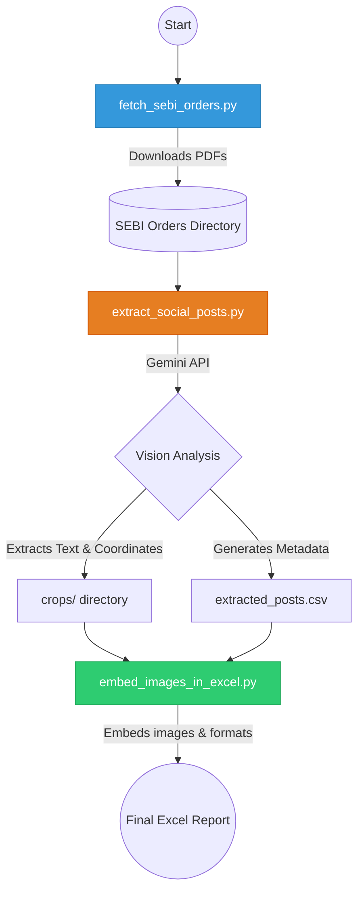

# SEBI Orders Social Media Extractor

A robust, end-to-end automated pipeline to download Securities and Exchange Board of India (SEBI) enforcement and exemption orders, parse the PDF documents, and intelligently extract screenshots and text of social media manipulations (Telegram, WhatsApp, Twitter, etc.) using the Google Gemini API.

## Key Features

- **Automated Web Scraping:** Headless downloading of SEBI orders by specific years or recent counts.
- **Intelligent Vision Extraction:** Uses Gemini's multimodal capabilities to scan hundreds of PDF pages, identifying screenshots of social media posts, chats, and internal communications.
- **Auto-Cropping:** Calculates bounding boxes and automatically crops the identified screenshots from the PDF pages.
- **Rich Reporting:** Generates a structured CSV, an HTML preview, and a beautifully formatted Excel report with the actual screenshot images embedded directly into the spreadsheet alongside the extracted text and metadata.

---

## Architecture & Workflow

The pipeline consists of three main stages: **Acquisition**, **Extraction**, and **Reporting**.


```mermaid
graph TD
    A((Start)) --> B[fetch_sebi_orders.py]
    B -- Downloads PDFs --> C[(SEBI Orders Directory)]
    C --> D[extract_social_posts.py]
    D -- Gemini API --> E{Vision Analysis}
    E -- Extracts Text & Coordinates --> F[crops/ directory]
    E -- Generates Metadata --> G[extracted_posts.csv]
    F --> H[embed_images_in_excel.py]
    G --> H
    H -- Embeds images & formats --> I((Final Excel Report))
    
    style B fill:#3498db,stroke:#2980b9,color:#fff
    style D fill:#e67e22,stroke:#d35400,color:#fff
    style H fill:#2ecc71,stroke:#27ae60,color:#fff
```

### 1. Acquisition (`fetch_sebi_orders.py`)
Scrapes the SEBI website using Playwright to handle Javascript pagination and iframe PDF embeddings.
- Capable of downloading by year (e.g., all of 2026).
- Capable of downloading a specific count of the most recent orders.

### 2. Extraction (`extract_social_posts.py`)
The core engine. It converts PDF pages to images in-memory and sends them to the Gemini API to detect social media posts.
- **Input:** Directory of PDFs.
- **Output:** `extracted_posts.csv` and individual image crops saved in the `crops/` folder.

### 3. Reporting (`embed_images_in_excel.py` / `csv_to_excel.py`)
Takes the raw CSV data and the physical image crops and stitches them together into a final, shareable Excel document where the images are embedded natively in the cells.

---

## Setup & Installation

### Prerequisites
1. **Python 3.9+**
2. **Google Gemini API Key** (You must have an API key from Google AI Studio).
3. **Playwright** (for headless browser scraping).

### 1. Install Dependencies
```bash
pip install -r requirements.txt
# Install Playwright browser binaries
playwright install chromium
```
*(Dependencies include: `google-genai`, `PyMuPDF`, `Pillow`, `pandas`, `openpyxl`, `playwright`, `python-dotenv`)*

### 2. Configure Environment Variables
Create a `.env` file in the root of the project to store your Gemini API key securely.
```env
GEMINI_API_KEY=your-gemini-api-key
```

---

## Usage Guide

### Step 1: Download SEBI Orders
Run the fetch script to populate a local directory with PDFs.

**Download specific year:**
```bash
python3 fetch_sebi_orders.py --year 2025
```

**Download recent N orders:**
```bash
python3 fetch_sebi_orders.py --recent 50
```

### Step 2: Extract Social Media Data
Ensure `PDF_DIR` in `extract_social_posts.py` points to the folder you just downloaded (e.g., `sebi order 2025`). Run the extraction:

```bash
python3 extract_social_posts.py
```
*Note: Depending on the number of PDFs and pages, this may take some time. The script automatically handles Gemini API rate limits and fallbacks.*

### Step 3: Generate Final Excel Report
Once extraction is complete, compile everything into an Excel file:

```bash
python3 embed_images_in_excel.py
```
This will output `final_extracted_posts_with_images.xlsx` containing the structured data and embedded screenshots!

---

## Security Note
The `.gitignore` is configured to prevent accidental uploads of your `.env` file, as well as any downloaded PDFs, temporary logs, or output CSV/Excel files. Only the source code is tracked by version control.

---

## Downstream Markdown Generation & LLM Analysis

After generating the structured Excel reports, the data undergoes further processing to facilitate deep qualitative analysis using Large Language Models (LLMs). This is crucial for identifying underlying patterns of finance misinformation, behavioral hooks, and fraudulent schemes.

### 4. Markdown Data Formatting (`extract_text_for_analysis.py`)
The structured data in the Excel files (e.g., `final_2024_extracted_posts_with_images.xlsx`) needs to be converted into a format optimal for LLM consumption. 
- Python scripts use `pandas` to parse the Excel rows and extract key contextual fields, primarily the "Extracted Text" and "Modus Operandi".
- This data is then formatted and dumped into an intermediate raw markdown file (e.g., `temp_data_2024.md`). Each entry is sequentially listed, making the textual observations readily available.

### 5. Advanced Context-Aware LLM Analysis 
The intermediate Markdown file serves as the knowledge base for LLM-driven analysis (e.g., utilizing Gemini 3.1 Pro).

**Technical Considerations (Chunking):**
Due to the constraints of LLM context windows and the need to maintain high recall, the entire compilation of extracted posts is **not** passed as a single monolithic payload. Instead, the raw texts are programmatically passed as discrete **chunks** (or batches). This chunking strategy ensures that the prompt context remains highly focused, avoiding middle-context loss and preventing token limit saturation. 

**Prompt Engineering for Pattern Extraction:**
The analysis utilizes sophisticated Zero-shot and Few-shot prompting techniques. The model evaluates the chunked text data against targeted analytical instructions to identify:
- **Structural Patterns:** Formatting quirks, specific emojis, urgency indicators.
- **Psychological Hooks:** FOMO (Fear Of Missing Out), guaranteed return promises, insider information claims.
- **Fraud Taxonomies:** Pump-and-dump, front-running, unregistered advisory models.

The resulting insights from these chunked analyses are synthesized into a final comprehensive Markdown report (e.g., `2024_finance_misinformation_analysis-gemini-3.1-pro.md`), detailing the systematic modus operandi observed across the social media landscape for that specific timeframe.
